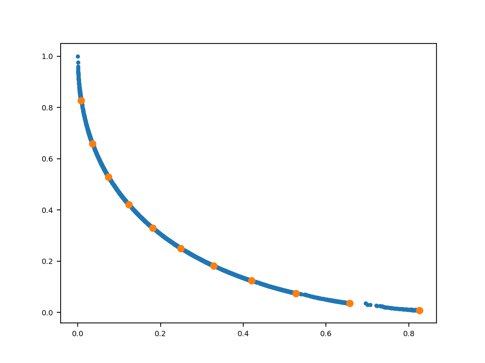
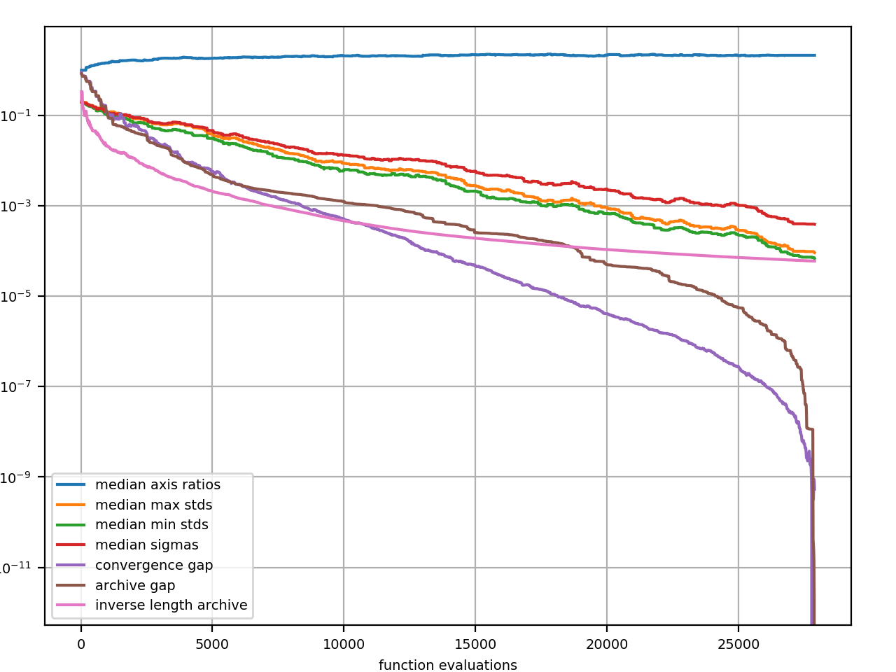
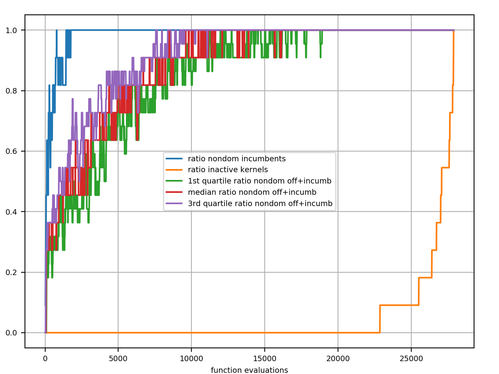
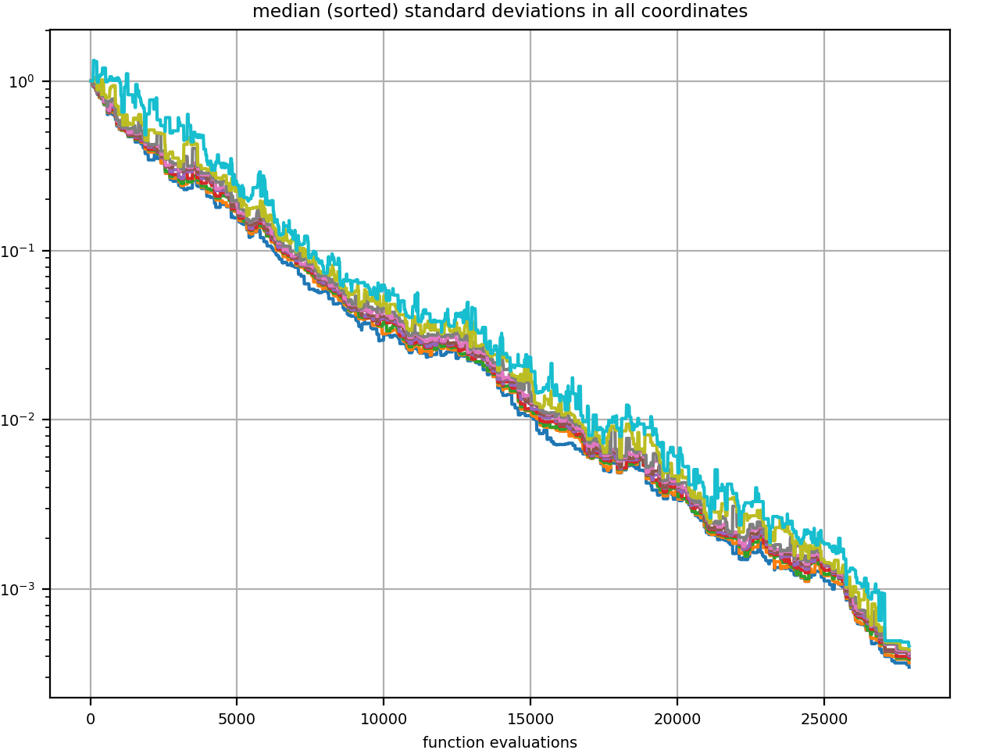

``pycomocma`` is a Python implementation of [COMO-CMA-ES](https://hal.inria.fr/hal-02103694/document) which is a Multiobjective Evolution Strategy, based upon the [Covariance Matrix Adaptation Evolution Strategy](https://en.wikipedia.org/wiki/CMA-ES) 
([CMA-ES](http://cma.gforge.inria.fr/)) single optimizer.

For the time being, only the bi-objective case is tested and functional.

# Use case examples


```python
import cma, comocma
```

# Setting parameters


```python
dimension = 10  # dimension of the search space
num_kernels = 11 # number of single-objective solvers (number of points we seek to have on the front)
sigma0 = 0.2    # initial step-sizes
```

# Instantiate a multiobjective solver


```python
list_of_solvers = comocma.get_cmas(num_kernels * [dimension * [0]], sigma0) # produce `num_kernels cma instances`
moes = comocma.Sofomore(list_of_solvers, [1.1,1.1]) # create a como-cma-es instance
```

# Setting a callable bi-objective function


```python
fitness = comocma.FitFun(lambda x: 1/len(x) * cma.ff.sphere(x), lambda x: 1/len(x) * cma.ff.sphere(x-1))
# a callable bi-objective function
```

# The "Optimize" interface


```python
moes.optimize(fitness)
```

    Iterat #Fevals   Hypervolume   axis ratios   sigmas   min&max stds
                                      (median)  (median)    (median)
        1     21 1.100000000000001e-01 1.0e+00 2.00e-01  2e-01  2e-01
        2     32 2.057604021865781e-01 1.0e+00 2.00e-01  2e-01  2e-01
        3     43 2.488017861107676e-01 1.0e+00 2.00e-01  2e-01  2e-01
      100   1110 9.107836011129092e-01 1.5e+00 1.12e-01  1e-01  1e-01
      200   2210 9.625474421555418e-01 1.6e+00 8.93e-02  7e-02  8e-02
      300   3310 9.920206331200579e-01 1.9e+00 6.83e-02  5e-02  6e-02
      400   4410 1.004189669174176e+00 1.8e+00 5.66e-02  4e-02  5e-02
      500   5510 1.008325475509909e+00 1.9e+00 3.66e-02  2e-02  3e-02
      600   6610 1.010082758462965e+00 2.0e+00 2.91e-02  2e-02  2e-02
      700   7710 1.010822801181834e+00 2.0e+00 2.13e-02  1e-02  2e-02
      800   8810 1.011397569792026e+00 2.1e+00 1.50e-02  8e-03  1e-02
      900   9910 1.011664457755347e+00 2.1e+00 1.37e-02  6e-03  9e-03
     1000  11010 1.011844293390875e+00 2.1e+00 1.08e-02  5e-03  7e-03
     1100  12110 1.011986789850910e+00 2.1e+00 1.13e-02  5e-03  7e-03
     1200  13210 1.012088529847934e+00 2.2e+00 9.72e-03  4e-03  5e-03
     1300  14310 1.012132079488995e+00 2.1e+00 7.18e-03  3e-03  4e-03
     1400  15410 1.012152873948374e+00 2.3e+00 4.84e-03  2e-03  2e-03
     1500  16510 1.012170061201212e+00 2.2e+00 4.32e-03  1e-03  2e-03
     1600  17610 1.012178572723334e+00 2.2e+00 3.03e-03  1e-03  1e-03
     1700  18710 1.012184711793784e+00 2.2e+00 3.24e-03  1e-03  1e-03
     1800  19810 1.012187622353882e+00 2.1e+00 2.29e-03  7e-04  9e-04
     1900  20910 1.012189369245771e+00 2.2e+00 1.84e-03  5e-04  7e-04
     2000  22010 1.012190613337772e+00 2.2e+00 1.40e-03  3e-04  5e-04
     2100  23110 1.012191280650714e+00 2.1e+00 1.29e-03  3e-04  4e-04
     2200  24210 1.012191715590123e+00 2.1e+00 1.02e-03  2e-04  3e-04
     2300  25310 1.012192010838341e+00 2.1e+00 9.58e-04  2e-04  3e-04
     2400  26410 1.012192119554191e+00 2.1e+00 5.69e-04  1e-04  1e-04
     2500  27510 1.012192183135902e+00 2.1e+00 4.01e-04  7e-05  1e-04
     2535  27895 1.012192187904571e+00 2.1e+00 3.91e-04  7e-05  9e-05


    <comocma.Sofomore at 0x11a9566d0>


# Plot the estimated pareto front


```python
figure()
moes.logger.plot_front()
```




# Divers plots about the multiobjective solver convergence


```python
figure()
moes.logger.plot_divers()
```





    <sofomore_logger.SofomoreDataLogger at 0x11a96a710>


# Plotting the logged data of `moes[0]`, which is a CMA-ES instance


```python
cma.plot("cma_kernels/0")
```


    <cma.logger.CMADataLogger at 0x11a96fe50>


# Plot some ratios about the evolution of non-dominated points


```python
figure()
moes.logger.plot_ratios()     
```



    <sofomore_logger.SofomoreDataLogger at 0x11a96a710>


# Plot median standard deviations of the single-objectve solver instances (cma-es)


```python
figure()
moes.logger.plot_stds()        
```



    <sofomore_logger.SofomoreDataLogger at 0x11a96a710>


# The "ask and tell" interface (generate and update in the CS community)


```python
list_of_solvers = comocma.get_cmas(num_kernels * [dimension * [0]], 0.2, inopts = {'bounds': [0.2, 0.9], 
                                                                                'tolx': 10**-7,
                                                                               'popsize': 32}) # produce `num_kernels cma instances`
moes = comocma.Sofomore(list_of_solvers, [0.6,0.9], {'verb_disp': 50}) # create a COMO-CMA-ES instance

fitness = comocma.FitFun(lambda x: 1/len(x) * cma.ff.sphere(x), lambda x: 1/len(x) * cma.ff.sphere(x-1))
```


```python
while not moes.stop():
    solutions = moes.ask("all") # all the kernels are updated in one iteration: useful for a run where the 
    # evaluations in the next command are distributed. Note that this is an approximation of the exact algorithm.
    # For the latter, the kernels are updated sequentially; one by one.
    objective_values = [fitness(x) for x in solutions]
    moes.tell(solutions, objective_values)
    moes.disp()          # display datas during the optimization for the first three iterations and for each `verb_disp` iteration
    moes.logger.add()    # log data after each `ask` and `tell` call

```

    Iterat #Fevals   Hypervolume   axis ratios   sigmas   min&max stds
                                      (median)  (median)    (median)
        1    363 1.990425600000000e-01 1.0e+00 2.20e-01  2e-01  2e-01
        2    726 2.489743335091563e-01 1.3e+00 2.71e-01  3e-01  3e-01
        3   1089 2.690696225267876e-01 1.5e+00 3.35e-01  3e-01  4e-01
       50  18150 3.438161001366409e-01 4.5e+00 3.13e-01  1e-01  3e-01
      100  36300 3.514071459822180e-01 3.0e+00 1.03e-01  2e-02  3e-02
      150  54418 3.567065179654489e-01 2.3e+00 4.02e-02  4e-03  5e-03
      200  70918 3.567360000795614e-01 1.9e+00 1.27e-02  3e-04  3e-04
      250  87418 3.567361565136758e-01 1.7e+00 4.93e-03  4e-05  5e-05
      300 103918 3.581760717626220e-01 2.6e+00 5.52e-01  1e-02  1e-02
      350 120418 3.585175627884697e-01 2.1e+00 5.51e-01  7e-04  9e-04
      400 136918 3.585192155465646e-01 2.0e+00 2.41e-01  1e-04  2e-04
      450 153418 3.585192754223465e-01 1.9e+00 1.67e-01  2e-05  3e-05
      500 169918 3.585192773650943e-01 2.0e+00 8.50e-02  4e-06  5e-06
      550 186418 3.585192774241047e-01 2.0e+00 4.23e-02  7e-07  9e-07
      600 202326 3.585192774258376e-01 2.0e+00 1.71e-02  1e-07  1e-07
      650 205930 3.585192774258548e-01 2.0e+00 1.56e-02  8e-08  1e-07
      700 207580 3.585192774258548e-01 2.0e+00 1.56e-02  8e-08  1e-07
      750 209230 3.585192774258548e-01 2.0e+00 1.56e-02  8e-08  1e-07
      800 210880 3.585192774258548e-01 2.0e+00 1.56e-02  8e-08  1e-07
      850 212530 3.585192774258548e-01 2.0e+00 1.56e-02  8e-08  1e-07
      900 214180 3.590987892232973e-01 2.0e+00 1.56e-02  8e-08  1e-07
      950 215830 3.592968328122365e-01 2.0e+00 1.56e-02  8e-08  1e-07
     1000 217480 3.593006863555457e-01 2.0e+00 1.56e-02  8e-08  1e-07
     1050 219130 3.593013240082196e-01 2.0e+00 1.56e-02  8e-08  1e-07
     1099 220747 3.593013240142108e-01 2.0e+00 1.39e-02  8e-08  1e-07


```python
moes.termination_status
```


    {0: {'tolx': 1e-07},
     1: {'tolx': 1e-07},
     2: {'tolx': 1e-07},
     3: {'tolx': 1e-07},
     4: {'tolx': 1e-07},
     5: {'tolx': 1e-07},
     6: {'tolx': 1e-07},
     7: {'tolx': 1e-07},
     8: {'tolx': 1e-07},
     9: {'tolx': 1e-07},
     10: {'tolx': 1e-07}}


```python
figure()
moes.logger.plot_front()      # plot the estimated pareto front
```

")
